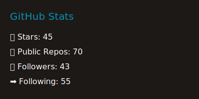

# Hi 👋 My name is Keshav Mohta

## A thinking software engineer

immersed in diverse web technologies since 2009, with a primary focus on HTML, CSS, JavaScript and TypeScript. Staying updated with industry trends is a constant commitment and I possess substantial expertise in Angular, React, PHP and MySQL.

Having 53k+ Reputation over [StackOverflow](https://stackoverflow.com/users/155861/xkeshav?tab=profile).

Prioritizing the accessibility and maintainability of codebase is integral to my coding philosophy.

Below are few of my open source projects

- VS Code Extension - [CSS Color Collector][ccc]
- NPM Packages
  - [Watch][npm]
  - [gh-repo-care][gh-repo-care]
- [Blog](http://xkeshav.com)

Also hold an AWS practitioner certificate

- 🌍  I'm based in India
- 🖥️  See my portfolio at [xkeshav.com](http://www.xkeshav.com)
- 📜 My [Gist](https://gist.github.com/xkeshav)
- 📬 You can contact me at [xkeshav@gmail.com](mailto:xkeshav@gmail.com)
- 🧠  I'm learning Typescript + Astro JS + Hono
- 🤝  I'm open to collaborating on JavaScript and TypeScript projects
- ⚡  love books and music and meeting.

### Skills

## Socials

### Badges<b>My GitHub Stats</b>

---

## Personal Projects

[ccc]: https://marketplace.visualstudio.com/items?itemName=xkeshav.css-color-collector
[npm]: https://www.npmjs.com/package/@xkeshav/watch
[gh-repo-care]: https://www.npmjs.com/package/@xkeshav/gh-repo-care
